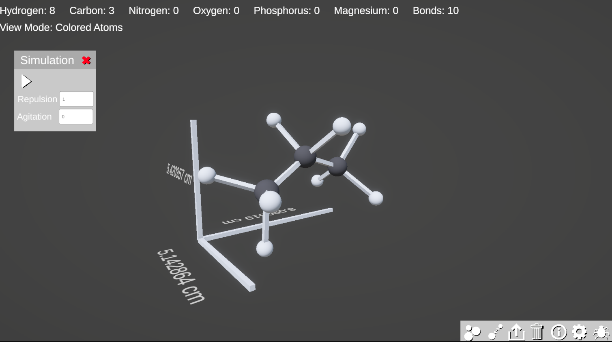
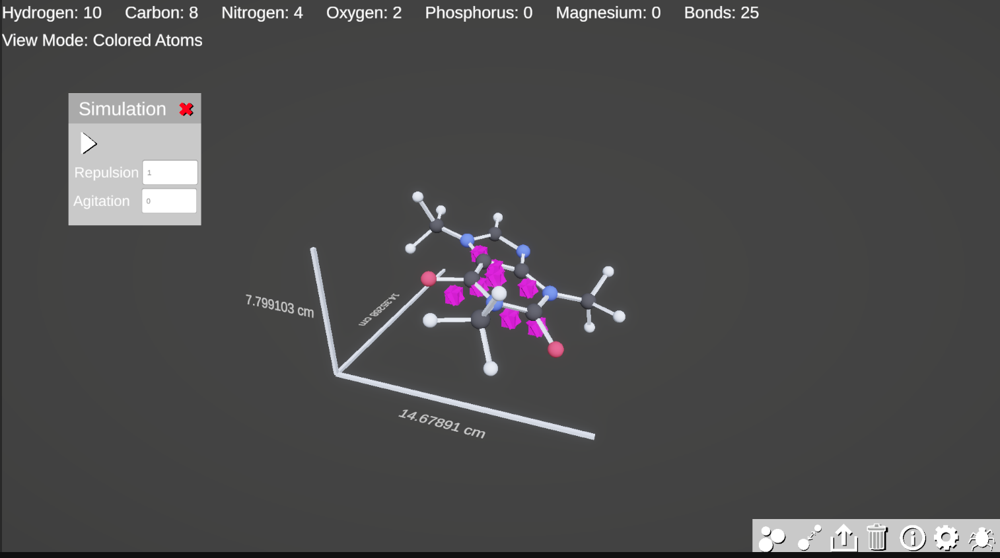
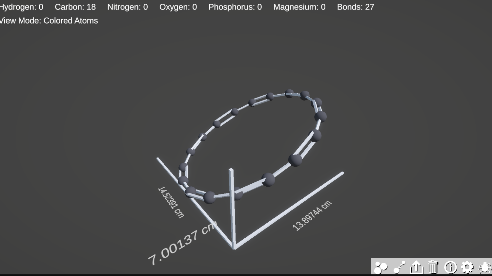
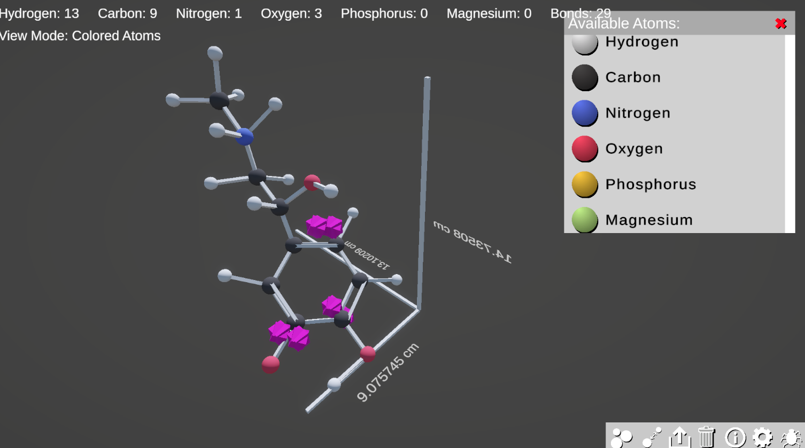

# A Simple 3D Molecule Creation Toolbox

MM3D is a software that I made for a chemistry assignment, where the goal was to design a model of an organic molecule.

It allows you to construct a molecule using a few types of atoms commonly found in organic compounds, as well as simulate what the molecular structure of the molecule will be. You are also able to export your molecule to a series of print plates that you can drop in to your 3D printer, if you want to make a physical model.

## Installation:
You can download MM3D from the 'Releases' page of this repository. From there, just run the .exe file and you're good to go.

## Screenshots:

***

***

***

## Credits:
Everything here was developed by Maximilian McDiarmid, aka. 10tothe6.
